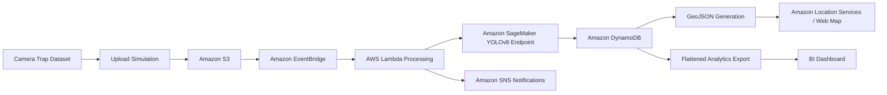

# WildSight EdgeCloud: Mission-Scale Wildlife Detection and Geospatial Intelligence Pipeline

**WildSight EdgeCloud** is a cloud-native AI/ML research and engineering project for automated wildlife detection, geospatial intelligence generation, and scalable model inference across AWS services. The system combines **YOLOv8 computer vision**, **Amazon SageMaker inference**, **Amazon S3 data ingestion**, **AWS Lambda processing**, **Amazon DynamoDB metadata storage**, **Amazon EventBridge orchestration**, **Amazon SNS notifications**, **Amazon Location Services compatible geospatial visualization**, and **GeoJSON/BI-ready analytics artifacts** to transform camera-trap imagery into structured location intelligence.

The project is designed as an applied AI systems research pipeline, emphasizing the full lifecycle required to operationalize visual detection models: data ingestion, inference, metadata persistence, event-driven automation, geospatial enrichment, analytics export, containerized execution, orchestration readiness, and cost-aware infrastructure management.

---

## Architecture Overview



---

## AWS Services Used

| AWS Service | Role in the System |
|---|---|
| Amazon S3 | Stores camera-trap images, upload artifacts, and ingestion-stage objects |
| Amazon SageMaker | Hosts the YOLOv8 inference endpoint used for wildlife detection |
| Amazon DynamoDB | Stores image metadata, prediction records, and inference outputs |
| Amazon EventBridge | Coordinates event-driven workflow triggers for ingestion, logging, notification, and artifact generation |
| AWS Lambda | Runs event-driven processing logic for ingestion logging, classification workflow handling, batch notification, and GeoJSON generation |
| Amazon SNS | Sends notification events for image uploads, classifications, and pipeline updates |
| Amazon Location Services | Supports map-based visualization and location-aware analysis of wildlife detection outputs through GeoJSON-compatible geospatial artifacts |
| AWS IAM | Controls scoped permissions across storage, inference, event, notification, and processing services |
| Amazon CloudWatch | Recommended for logs, endpoint metrics, event monitoring, operational dashboards, and failure investigation |

---

## Geospatial and Location Intelligence Layer

The pipeline generates GeoJSON artifacts from prediction records to support downstream map-based analytics. This layer is designed to integrate with **Amazon Location Services** or compatible web-mapping tools for visualizing wildlife detections across geographic coordinates.

Amazon Location Services can support:

- Map rendering for wildlife detection points
- Location-aware visualization of species activity
- Geospatial filtering and regional analysis
- Operational map-based decision support
- Integration of prediction outputs with broader location intelligence workflows

---

## Repository Structure

```text
.
├── benchmarks/              # Inference profiling and benchmarking utilities
├── docs/                    # Research, architecture, observability, and reproducibility docs
├── experiments/             # Experiment tracking artifacts
├── k8s/                     # Kubernetes deployment manifests
├── lambdas/                 # Event-driven AWS Lambda workflows
├── Model/                   # YOLOv8 model artifacts and inference logic
├── src/                     # S3 ingestion and streaming utilities
├── stage2_yolov8/           # SageMaker deployment workflows
├── utils/                   # Dataset download and provisioning helpers
├── .github/workflows/       # CI validation workflows
├── Dockerfile               # Containerized execution configuration
└── README.md
```

---

## Documentation Index

| Document | Purpose |
|---|---|
| [Architecture](docs/architecture.md) | System architecture and AWS workflow |
| [Research Report](docs/research_report.md) | Research framing and methodology |
| [Benchmarking](docs/benchmarking.md) | Benchmarking and profiling strategy |
| [Model Card](docs/model_card.md) | YOLOv8 model documentation |
| [Data Card](docs/data_card.md) | Dataset structure and limitations |
| [Observability](docs/observability.md) | Monitoring and failure-mode strategy |
| [Reproducibility](docs/reproducibility.md) | Reproducibility and experiment tracking |

---

## Research Context

Wildlife monitoring programs increasingly depend on large-scale camera-trap imagery to study animal movement, habitat use, species distribution, and ecological risk. Manual image review is slow, expensive, inconsistent, and difficult to scale across large geographic regions. Raw detections alone are also insufficient for operational decision support because model outputs must be connected to location, time, metadata, and downstream visualization workflows.

This project investigates how a cloud-native computer vision pipeline can automate the conversion of raw camera-trap images into geospatial intelligence products. The system is structured around an end-to-end ML workflow where images are ingested, processed by a YOLOv8 detection model, enriched with metadata, stored in a structured database, and exported into analytics-ready formats.

---

## Research Gap

Many wildlife AI implementations focus primarily on object detection accuracy, while fewer address the operational lifecycle required to deploy computer vision systems in real environments. Important gaps include:

- Limited integration between model inference and cloud-native event orchestration
- Weak support for geospatial outputs usable by analysts and decision makers
- Insufficient attention to scalable metadata storage and downstream analytics
- Limited reproducibility guidance for cloud-based inference workflows
- Incomplete treatment of deployment tradeoffs, cost, reliability, and operational readiness

WildSight EdgeCloud addresses these gaps by treating wildlife detection as a complete AI system design problem rather than only a model prediction task.

---

## Technical Contribution

This repository contributes a reference architecture for cloud-native wildlife detection and geospatial analytics using AWS-managed services and YOLOv8 inference. The main technical contributions include:

- End-to-end image ingestion and inference workflow for camera-trap data
- YOLOv8-based object detection pipeline deployed through Amazon SageMaker
- Event-driven processing through Amazon EventBridge and AWS Lambda
- Prediction and metadata persistence using Amazon DynamoDB
- Automated notification workflow through Amazon SNS
- Amazon Location Services compatible geospatial visualization layer
- Flattened JSON generation for BI workflows
- GeoJSON generation for map-based visualization
- Docker-based containerization for reproducible runtime environments
- Kubernetes manifests for orchestration-ready deployment patterns
- Operational framing around scalability, reproducibility, cost control, security, and deployment readiness

---

## System Architecture

The pipeline follows a cloud-native, event-driven architecture:

1. **Dataset Ingestion**  
   Camera-trap imagery is retrieved from a public wildlife dataset and staged for simulation.

2. **Object Storage**  
   Images and associated metadata are uploaded to Amazon S3, representing a camera-trap ingestion source.

3. **Event Orchestration and Processing**  
   Amazon EventBridge routes events to AWS Lambda functions that support ingestion logging, notification handling, classification workflow execution, and geospatial artifact generation.

4. **Model Inference**  
   A YOLOv8 model is served through an Amazon SageMaker endpoint for wildlife detection.

5. **Metadata and Prediction Storage**  
   Image metadata and model prediction outputs are stored in Amazon DynamoDB.

6. **Notification Layer**  
   Amazon SNS supports email-based notification of image events and classification outputs.

7. **Geospatial Analytics Layer**  
   Prediction records are transformed into flattened JSON and GeoJSON outputs for BI dashboards, Amazon Location Services compatible workflows, and web-map visualization.

---

## End-to-End ML Workflow

WildSight EdgeCloud demonstrates a full AI/ML workflow:

- Dataset acquisition through the Kaggle API
- Data staging and camera-trap upload simulation
- Cloud object storage using Amazon S3
- YOLOv8 inference through Amazon SageMaker
- Event-driven processing with Amazon EventBridge and AWS Lambda
- Prediction persistence in Amazon DynamoDB
- Notification delivery through Amazon SNS
- Export of analytics-ready artifacts for geospatial visualization
- Cost-aware cleanup of provisioned inference infrastructure

---

## Containerization and Orchestration

WildSight EdgeCloud includes containerization and orchestration-oriented deployment assets to support reproducible execution and scalable infrastructure workflows.

### Docker Support

The repository includes a Dockerfile for containerized execution of the inference and ingestion workflow. Docker is used as a deployment-readiness component to package the Python runtime, project dependencies, and pipeline entry point into a reproducible execution environment.

Containerization enables:

- Reproducible runtime environments
- Dependency isolation
- Portable deployment workflows
- Simplified cloud-native execution patterns
- More consistent execution across local, cloud, and CI environments

### Kubernetes Support

The repository includes Kubernetes deployment manifests under `k8s/`. These manifests provide an orchestration-ready foundation for future containerized batch inference, local reproducibility testing, and cloud-native deployment experiments.

The current workflow is primarily AWS-managed through SageMaker, S3, EventBridge, Lambda, DynamoDB, and SNS. The Dockerfile and Kubernetes manifests are included to show how the project can evolve toward containerized inference services, scalable workload orchestration, and portable infrastructure patterns.

Potential orchestration use cases include:

- Distributed inference workloads
- Batch image processing
- Horizontal scaling experiments
- Cloud-native deployment validation
- Infrastructure portability across managed Kubernetes environments

---

## Benchmarking and Evaluation Plan

The repository includes benchmarking utilities under `benchmarks/` and an experiment tracking template under `experiments/`. The table below defines the evaluation protocol and target metrics for measured experiments. Values are intentionally recorded as **pending measurement** until the full pipeline is executed in a controlled environment, avoiding unsupported or fabricated benchmark claims.

| Experiment | Evaluation Dataset | Input Resolution | Batch Size | Primary Metrics | Current Status | Notes |
|---|---:|---:|---:|---|---|---|
| SageMaker YOLOv8 Endpoint | 50 to 500 camera-trap images | 640x640 normalized inference input | 1 | Avg latency, P95 latency, throughput, invocation error rate | Pending controlled AWS run | Measures managed endpoint inference performance |
| Local YOLOv8 Baseline | 50 to 500 camera-trap images | 640x640 normalized inference input | 1 | Avg latency, P95 latency, images/sec, CPU/GPU utilization | Pending local benchmark | Establishes non-cloud baseline for comparison |
| Batch Ingestion Workflow | 100 to 1,000 camera-trap images | Source image resolution with preprocessing to model input | Configurable | End-to-end runtime, S3 upload throughput, DynamoDB write completeness, artifact generation success | Pending pipeline run | Measures ingestion-to-analytics workflow reliability |
| Geospatial Artifact Generation | Full prediction export set | Prediction records from DynamoDB | N/A | GeoJSON validity, flattened JSON completeness, record count consistency | Pending validation | Evaluates downstream analytics readiness |

Recommended measured outputs include:

- Average latency in milliseconds
- P50, P95, and P99 latency
- Images processed per second
- End-to-end pipeline runtime
- DynamoDB record completeness
- GeoJSON and flattened JSON validation status
- Endpoint invocation error rate
- Cloud resource cost during active inference windows

---

## Schema and Testing Roadmap

The current repository includes CI-based Python compilation checks through GitHub Actions. The next testing layer should introduce schema validation and unit tests for data contracts used across the pipeline.

Planned testing additions include:

```text
tests/
├── test_config_loading.py
├── test_geojson_schema.py
└── test_prediction_record_schema.py

schemas/
├── prediction_record.schema.json
└── geojson_feature.schema.json
```

These additions will support:

- Prediction record validation before DynamoDB persistence
- GeoJSON schema validation before map or BI consumption
- Configuration loading checks for deployment reproducibility
- Regression testing for artifact generation logic
- Stronger CI validation beyond Python syntax compilation

---

## Sample Outputs

Visual output artifacts can be added under `docs/assets/` as the pipeline is executed and evaluated.

Planned artifacts include:

- `docs/assets/sample_geojson_map.png`
- `docs/assets/sample_dashboard.png`
- `docs/assets/sample_prediction_output.png`

These outputs are intended to document geospatial visualization, BI-ready analytics, and representative model prediction records.

---

## Technology Stack

| Area | Tools and Services |
|---|---|
| Computer Vision | YOLOv8 |
| Programming | Python |
| Cloud Platform | AWS |
| Model Serving | Amazon SageMaker |
| Object Storage | Amazon S3 |
| Serverless Processing | AWS Lambda |
| Metadata Store | Amazon DynamoDB |
| Event Orchestration | Amazon EventBridge |
| Notification System | Amazon SNS |
| Location Intelligence | Amazon Location Services compatible GeoJSON workflow |
| Monitoring | Amazon CloudWatch recommended |
| Access Control | AWS IAM recommended |
| Containerization | Docker |
| Orchestration | Kubernetes manifests |
| CI/CD | GitHub Actions |
| Geospatial Output | GeoJSON |
| Analytics Output | Flattened JSON for BI workflows |
| Dataset Access | Kaggle API |
| Visualization | Power BI / web-map compatible outputs |

---

## Dataset

This project uses the **Spatiotemporal Wildlife Dataset** available through Kaggle:

https://www.kaggle.com/datasets/travisdaws/spatiotemporal-wildlife-dataset?resource=download&select=images

The configuration can be used with a smaller image subset for initial testing and expanded to larger species-specific folders for broader evaluation. The pipeline is structured so additional camera-trap datasets can be integrated with limited configuration changes.

---

## Methodology

### 1. Data Collection and Preparation

The dataset is retrieved using the Kaggle API. Images are organized by species and prepared for upload simulation into the AWS ingestion layer.

### 2. Cloud Ingestion Simulation

The main workflow simulates camera-trap image uploads into Amazon S3. Each image includes metadata that supports downstream geospatial and analytical processing.

### 3. Model Inference

The pipeline uses a YOLOv8 model endpoint deployed through Amazon SageMaker. Images are passed through the endpoint to generate detection predictions.

### 4. Prediction Persistence

Inference outputs and image metadata are written to DynamoDB, enabling structured querying, downstream transformation, and analytics.

### 5. Event-Driven Automation

EventBridge and AWS Lambda coordinate pipeline behavior, including ingestion logging, batch notification, and GeoJSON artifact creation.

### 6. Geospatial Output Generation

Prediction records are converted into:

- `wildlife_predictions_FLATTENED.json` for BI workflows
- `wildlife_predictions.geojson` for Amazon Location Services compatible map visualization and web-map workflows

---

## Evaluation Strategy

The project supports evaluation across ML quality, system performance, and operational reliability dimensions.

Potential evaluation metrics include:

- Detection confidence by species or image group
- Precision, recall, and mAP for labeled evaluation data
- End-to-end inference latency
- SageMaker endpoint response time
- Image ingestion throughput
- DynamoDB write consistency and record completeness
- Geospatial output validity
- Pipeline reliability across repeated simulation runs
- Cloud resource cost during active inference windows

---

## Operational Relevance

Although the applied domain is wildlife monitoring, the architecture is relevant to broader AI systems involving imagery, sensor events, metadata, and location-aware decision support.

Relevant application patterns include:

- Automated processing of imagery and sensor-derived data
- Cloud-native deployment of computer vision models
- Event-driven AI workflows for operational environments
- Metadata enrichment and structured prediction storage
- Location-aware intelligence generation
- Dashboard and map-based decision support
- Cost-aware management of provisioned inference infrastructure

The same design pattern can be adapted for disaster response, infrastructure inspection, environmental security, border monitoring, and other operational contexts where image data must be converted into timely analytical products.

---

## Security and Credential Handling

Do not commit cloud credentials, Kaggle tokens, or environment-specific secrets to this repository. Authentication files should remain local and should be excluded through `.gitignore` and `.dockerignore`.

For production use, prefer IAM roles, scoped permissions, temporary credentials, AWS Secrets Manager, or environment-based credential injection instead of long-lived local credential files.

---

## Configuration

Update `config.yaml` with the AWS user context, region, and notification email. Before running the pipeline, confirm that AWS resources are configured correctly, including S3 buckets, DynamoDB tables, EventBridge rules, Lambda functions, SNS subscription settings, SageMaker endpoint configuration, and geospatial visualization outputs.

---

## Setup and Execution

### 1. Install Dependencies

```bash
pip install kaggle boto3 pyyaml ultralytics
```

Install any additional project-specific dependencies required by the local environment.

### 2. Configure Kaggle Access

Generate a Kaggle API token and place `kaggle.json` in the local Kaggle configuration directory.

### 3. Download Dataset

Run the dataset download utility:

```bash
python utils/download_dataset.py
```

### 4. Prepare AWS Resources

Before execution, verify:

- The S3 ingestion bucket is available and old test images are removed if needed
- The DynamoDB table exists and old test records are cleared if needed
- EventBridge rules are enabled
- Lambda functions are deployed or available where applicable
- SNS subscription email is configured and confirmed
- SageMaker endpoint configuration is available
- GeoJSON output paths are available for location intelligence workflows

### 5. Create SageMaker Endpoint

In Amazon SageMaker, create an endpoint named:

```text
yolov8s
```

Use the configured YOLOv8 endpoint configuration available in the AWS environment.

### 6. Run Pipeline

Run the main workflow:

```bash
python main.py
```

During execution, the pipeline uploads images, performs inference, stores predictions, sends notifications, and generates analytics artifacts.

---

## Expected Outputs

After a successful run, the system produces:

- Uploaded image objects in the configured S3 bucket
- Metadata and prediction records in DynamoDB
- Email notifications through Amazon SNS
- `wildlife_predictions_FLATTENED.json` for BI ingestion
- `wildlife_predictions.geojson` for Amazon Location Services compatible map visualization and web-map workflows

---

## Cost Management

The SageMaker endpoint is provisioned infrastructure and may continue to incur cost while active. After testing or demonstration, delete the endpoint from Amazon SageMaker.

Do not delete reusable endpoint configurations, deployable models, DynamoDB tables, Lambda functions, EventBridge rules, or other shared infrastructure unless intentionally removing the full environment.

---

## Limitations

Current limitations include:

- The pipeline depends on preconfigured AWS resources
- SageMaker endpoint costs require cleanup after testing
- The current workflow is designed for simulation-style image ingestion rather than live camera hardware integration
- Evaluation depends on available labeled ground truth for species-level performance metrics
- Edge deployment and disconnected environment support are not yet fully implemented
- Docker and Kubernetes assets are deployment-readiness components and are not a replacement for the current AWS-managed SageMaker inference path

---

## Future Research Directions

Planned research and engineering extensions include:

- Containerized inference service using Docker
- Kubernetes deployment manifests for scalable inference workloads
- CI/CD workflow for automated testing and deployment validation
- Unit tests for configuration, prediction schemas, and GeoJSON artifacts
- JSON schema validation for DynamoDB prediction records and geospatial outputs
- Batch inference support for large camera-trap archives
- Edge deployment for disconnected or low-bandwidth environments
- Model monitoring and inference drift detection
- Latency and throughput benchmarking under different image-volume workloads
- Precision, recall, and mAP evaluation against labeled validation sets
- Integration with Amazon QuickSight and Amazon Location Services for fully cloud-native analytics and geospatial visualization
- Secure deployment patterns using IAM roles and least-privilege access control

---

## Repository Scope

WildSight EdgeCloud is a research-driven AI engineering repository focused on scalable computer vision deployment, geospatial intelligence, and operational ML workflow design. The project emphasizes not only model inference, but also the system-level requirements needed to transform raw visual data into reliable, usable, and location-aware analytical products.
