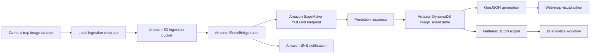

# System Architecture

WildSight EdgeCloud follows a cloud-native, event-driven architecture for transforming camera-trap imagery into structured wildlife detection and geospatial intelligence outputs.

## AWS Workflow

## Architectural Layers

### 1. Data Ingestion Layer

The ingestion layer simulates camera-trap image upload behavior. Images are staged locally, paired with metadata, and uploaded into Amazon S3.

### 2. Inference Layer

YOLOv8 inference is served through Amazon SageMaker. This separation allows model serving to be managed independently from ingestion and analytics logic.

### 3. Event Orchestration Layer

Amazon EventBridge coordinates downstream behavior such as ingestion logging, notification routing, and geospatial artifact creation.

### 4. Persistence Layer

Amazon DynamoDB stores metadata and prediction outputs in a structured format suitable for downstream querying and analytics.

### 5. Analytics Layer

Prediction records are exported into GeoJSON and flattened JSON outputs for map visualization and BI workflows.

## Design Goals

- End-to-end reproducible ML workflow
- Cloud-native inference and event-driven orchestration
- Geospatially meaningful prediction outputs
- Separation between storage, inference, metadata, and visualization layers
- Cost-aware use of provisioned infrastructure
